# 排序算法

## 选择排序

### 代码

[SelectionSort.java](../../../code/algo/sort/SelectionSort.java)

### 算法特性

- **时间复杂度为 O(n²)、非自适应排序**：外循环共 **n−1** 轮，第一轮的未排序区间长度为 **n** ，最后一轮的未排序区间长度为 **2** ，即各轮外循环分别包含 **n、n - 1、...、3、2** 轮内循环，求和为 **(n−1)(n+2)/2** 。
- **空间复杂度为 O(1)、原地排序**：指针 **i** 和 **j** 使用常数大小的额外空间。
- **非稳定排序**：如下图所示，元素 `nums[i]` 有可能被交换至与其相等的元素的右边，导致两者的相对顺序发生改变。

## 冒泡排序

### 代码

[BubbleSort.java](../../../code/algo/sort/BubbleSort.java)

### 算法特性

- **时间复杂度为O(n²) 、自适应排序**：各轮“冒泡”遍历的数组长度依次为 **n-1、n-2、...、2、1** ，总和为**(n-1)*n/2** 。在引入 `flag` 优化后，最佳时间复杂度可达到**O(n)** 。
- **空间复杂度为O(1) 、原地排序**：指针 **i**和 **j**使用常数大小的额外空间。
- **稳定排序**：由于在“冒泡”中遇到相等元素不交换。

## 插入排序

### 算法流程

插入排序的整体流程如图 11-7 所示。

1. 初始状态下，数组的第 1 个元素已完成排序。
2. 选取数组的第 2 个元素作为 `base` ，将其插入到正确位置后，**数组的前 2 个元素已排序**。
3. 选取第 3 个元素作为 `base` ，将其插入到正确位置后，**数组的前 3 个元素已排序**。
4. 以此类推，在最后一轮中，选取最后一个元素作为 `base` ，将其插入到正确位置后，**所有元素均已排序**。

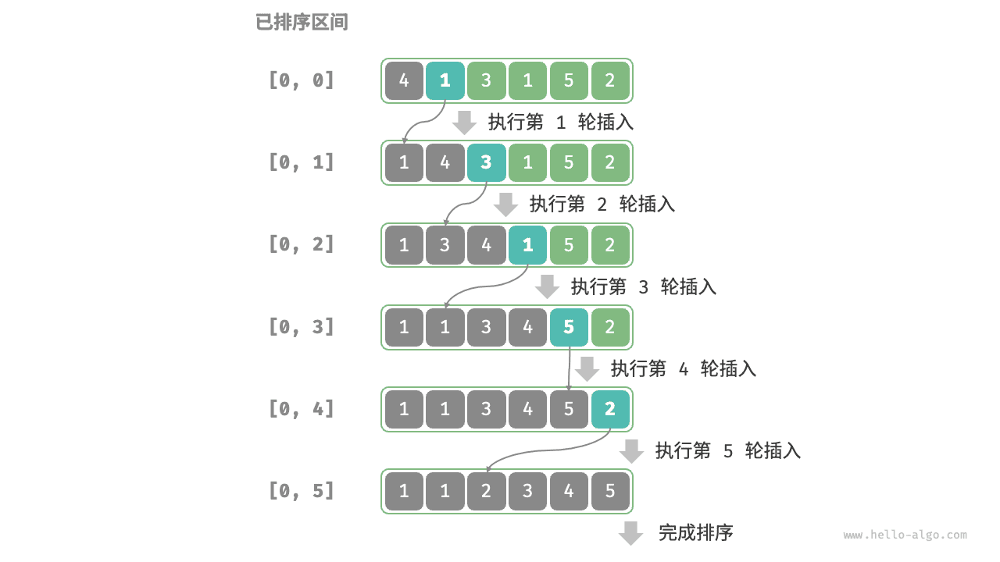

### 代码

[InsertionSort.java](../../../code/algo/sort/InsertionSort.java)

### 算法特性

- **时间复杂度为 $O(n^2)$、自适应排序**：在最差情况下，每次插入操作分别需要循环 $n - 1$、$n-2$、$\dots$、$2$、$1$ 次，求和得到 $(n - 1) n / 2$ ，因此时间复杂度为 $O(n^2)$ 。在遇到有序数据时，插入操作会提前终止。当输入数组完全有序时，插入排序达到最佳时间复杂度 $O(n)$ 。
- **空间复杂度为 $O(1)$、原地排序**：指针 $i$ 和 $j$ 使用常数大小的额外空间。
- **稳定排序**：在插入操作过程中，我们会将元素插入到相等元素的右侧，不会改变它们的顺序。

### 插入排序的优势

插入排序的时间复杂度为 $O(n^2)$ ，而我们即将学习的快速排序的时间复杂度为 $O(n \log n)$ 。尽管插入排序的时间复杂度更高，**但在数据量较小的情况下，插入排序通常更快**。

这个结论与线性查找和二分查找的适用情况的结论类似。快速排序这类 $O(n \log n)$ 的算法属于基于分治策略的排序算法，往往包含更多单元计算操作。而在数据量较小时，$n^2$ 和 $n \log n$ 的数值比较接近，复杂度不占主导地位，每轮中的单元操作数量起到决定性作用。

实际上，许多编程语言（例如 Java）的内置排序函数采用了插入排序，大致思路为：对于长数组，采用基于分治策略的排序算法，例如快速排序；对于短数组，直接使用插入排序。

虽然冒泡排序、选择排序和插入排序的时间复杂度都为 $O(n^2)$ ，但在实际情况中，**插入排序的使用频率显著高于冒泡排序和选择排序**，主要有以下原因。

- 冒泡排序基于元素交换实现，需要借助一个临时变量，共涉及 3 个单元操作；插入排序基于元素赋值实现，仅需 1 个单元操作。因此，**冒泡排序的计算开销通常比插入排序更高**。
- 选择排序在任何情况下的时间复杂度都为 $O(n^2)$ 。**如果给定一组部分有序的数据，插入排序通常比选择排序效率更高**。
- 选择排序不稳定，无法应用于多级排序。

## 快速排序

### 算法流程

快速排序的整体流程如下图所示。

1. 首先，对原数组执行一次“哨兵划分”，得到未排序的左子数组和右子数组。
2. 然后，对左子数组和右子数组分别递归执行“哨兵划分”。
3. 持续递归，直至子数组长度为 1 时终止，从而完成整个数组的排序。

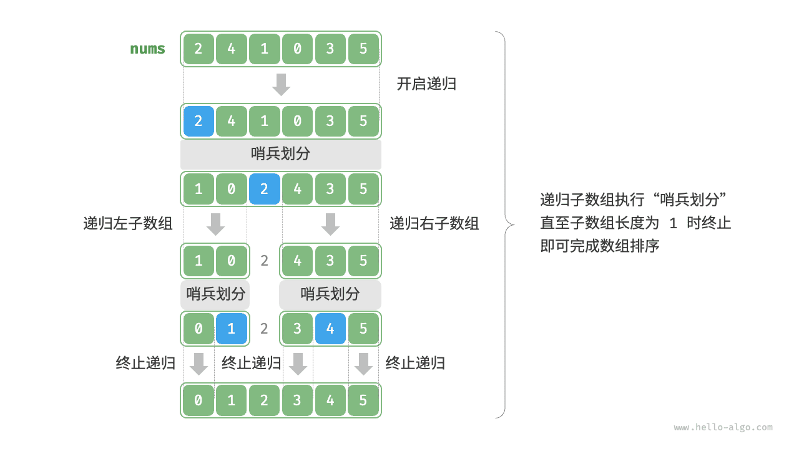

### 代码

[QuickSort.java](../../../code/algo/sort/QuickSort.java)

### 算法特性

- **时间复杂度为 $O(n \log n)$、非自适应排序**：在平均情况下，哨兵划分的递归层数为 $\log n$ ，每层中的总循环数为 $n$ ，总体使用 $O(n \log n)$ 时间。在最差情况下，每轮哨兵划分操作都将长度为 $n$ 的数组划分为长度为 $0$ 和 $n - 1$ 的两个子数组，此时递归层数达到 $n$ ，每层中的循环数为 $n$ ，总体使用 $O(n^2)$ 时间。
- **空间复杂度为 $O(n)$、原地排序**：在输入数组完全倒序的情况下，达到最差递归深度 $n$ ，使用 $O(n)$ 栈帧空间。排序操作是在原数组上进行的，未借助额外数组。
- **非稳定排序**：在哨兵划分的最后一步，基准数可能会被交换至相等元素的右侧。

### 快速排序为什么快

从名称上就能看出，快速排序在效率方面应该具有一定的优势。尽管快速排序的平均时间复杂度与“归并排序”和“堆排序”相同，但通常快速排序的效率更高，主要有以下原因。

- **出现最差情况的概率很低**：虽然快速排序的最差时间复杂度为 $O(n^2)$ ，没有归并排序稳定，但在绝大多数情况下，快速排序能在 $O(n \log n)$ 的时间复杂度下运行。
- **缓存使用效率高**：在执行哨兵划分操作时，系统可将整个子数组加载到缓存，因此访问元素的效率较高。而像“堆排序”这类算法需要跳跃式访问元素，从而缺乏这一特性。
- **复杂度的常数系数小**：在上述三种算法中，快速排序的比较、赋值、交换等操作的总数量最少。这与“插入排序”比“冒泡排序”更快的原因类似。

### 基准数优化

**快速排序在某些输入下的时间效率可能降低**。举一个极端例子，假设输入数组是完全倒序的，由于我们选择最左端元素作为基准数，那么在哨兵划分完成后，基准数被交换至数组最右端，导致左子数组长度为 $n - 1$、右子数组长度为 $0$ 。如此递归下去，每轮哨兵划分后都有一个子数组的长度为 $0$ ，分治策略失效，快速排序退化为“冒泡排序”的近似形式。

为了尽量避免这种情况发生，**我们可以优化哨兵划分中的基准数的选取策略**。例如，我们可以随机选取一个元素作为基准数。然而，如果运气不佳，每次都选到不理想的基准数，效率仍然不尽如人意。

需要注意的是，编程语言通常生成的是“伪随机数”。如果我们针对伪随机数序列构建一个特定的测试样例，那么快速排序的效率仍然可能劣化。

为了进一步改进，我们可以在数组中选取三个候选元素（通常为数组的首、尾、中点元素），**并将这三个候选元素的中位数作为基准数**。这样一来，基准数“既不太小也不太大”的概率将大幅提升。当然，我们还可以选取更多候选元素，以进一步提高算法的稳健性。采用这种方法后，时间复杂度劣化至 $O(n^2)$ 的概率大大降低。代码如下：

```java
/* 选取三个候选元素的中位数 */
int medianThree(int[] nums, int left, int mid, int right) {
    int l = nums[left], m = nums[mid], r = nums[right];
    if ((l <= m && m <= r) || (r <= m && m <= l))
        return mid; // m 在 l 和 r 之间
    if ((m <= l && l <= r) || (r <= l && l <= m))
        return left; // l 在 m 和 r 之间
    return right;
}

/* 哨兵划分（三数取中值） */
int partition(int[] nums, int left, int right) {
    // 选取三个候选元素的中位数
    int med = medianThree(nums, left, (left + right) / 2, right);
    // 将中位数交换至数组最左端
    swap(nums, left, med);
    // 以 nums[left] 为基准数
    int i = left, j = right;
    while (i < j) {
        while (i < j && nums[j] >= nums[left])
            j--;          // 从右向左找首个小于基准数的元素
        while (i < j && nums[i] <= nums[left])
            i++;          // 从左向右找首个大于基准数的元素
        swap(nums, i, j); // 交换这两个元素
    }
    swap(nums, i, left);  // 将基准数交换至两子数组的分界线
    return i;             // 返回基准数的索引
}
```


### 递归深度优化

**在某些输入下，快速排序可能占用空间较多**。以完全有序的输入数组为例，设递归中的子数组长度为 $m$ ，每轮哨兵划分操作都将产生长度为 $0$ 的左子数组和长度为 $m - 1$ 的右子数组，这意味着每一层递归调用减少的问题规模非常小（只减少一个元素），递归树的高度会达到 $n - 1$ ，此时需要占用 $O(n)$ 大小的栈帧空间。

为了防止栈帧空间的累积，我们可以在每轮哨兵排序完成后，比较两个子数组的长度，**仅对较短的子数组进行递归**。由于较短子数组的长度不会超过 $n / 2$ ，因此这种方法能确保递归深度不超过 $\log n$ ，从而将最差空间复杂度优化至 $O(\log n)$ 。代码如下所示：

```java
/* 快速排序（递归深度优化） */
void quickSort(int[] nums, int left, int right) {
    // 子数组长度为 1 时终止
    while (left < right) {
        // 哨兵划分操作
        int pivot = partition(nums, left, right);
        // 对两个子数组中较短的那个执行快速排序
        if (pivot - left < right - pivot) {
            quickSort(nums, left, pivot - 1); // 递归排序左子数组
            left = pivot + 1; // 剩余未排序区间为 [pivot + 1, right]
        } else {
            quickSort(nums, pivot + 1, right); // 递归排序右子数组
            right = pivot - 1; // 剩余未排序区间为 [left, pivot - 1]
        }
    }
}
```


## 归并排序

### 算法流程

如下图所示，“划分阶段”从顶至底递归地将数组从中点切分为两个子数组。

1. 计算数组中点 `mid` ，递归划分左子数组（区间 `[left, mid]` ）和右子数组（区间 `[mid + 1, right]` ）。
2. 递归执行步骤 `1.` ，直至子数组区间长度为 1 时终止。

“合并阶段”从底至顶地将左子数组和右子数组合并为一个有序数组。需要注意的是，从长度为 1 的子数组开始合并，合并阶段中的每个子数组都是有序的。

=== "<1>"
    

=== "<2>"
    

=== "<3>"
    

=== "<4>"
    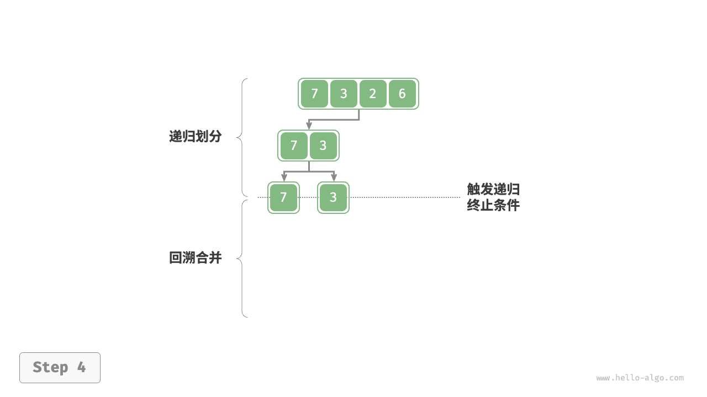

=== "<5>"
    

=== "<6>"
    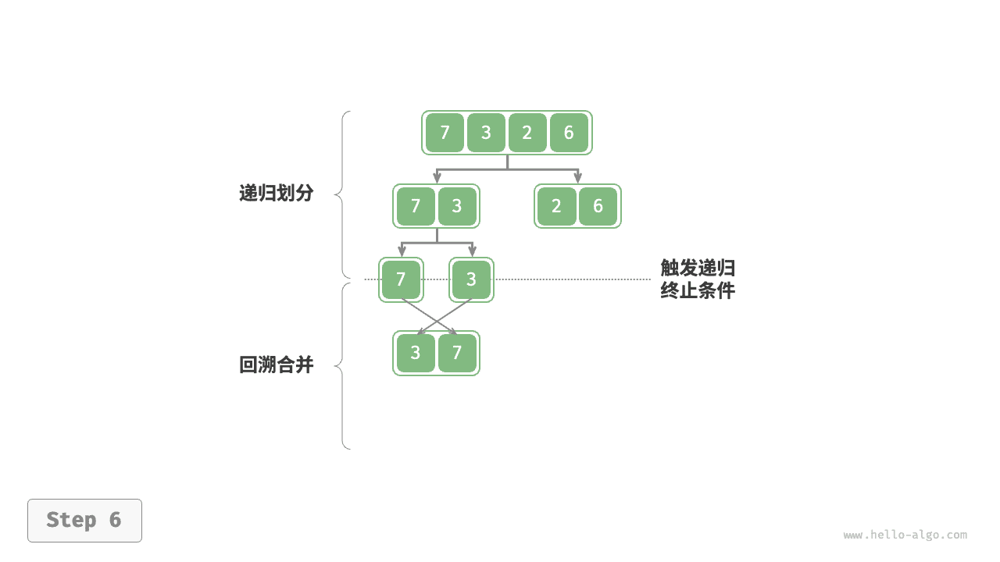

=== "<7>"
    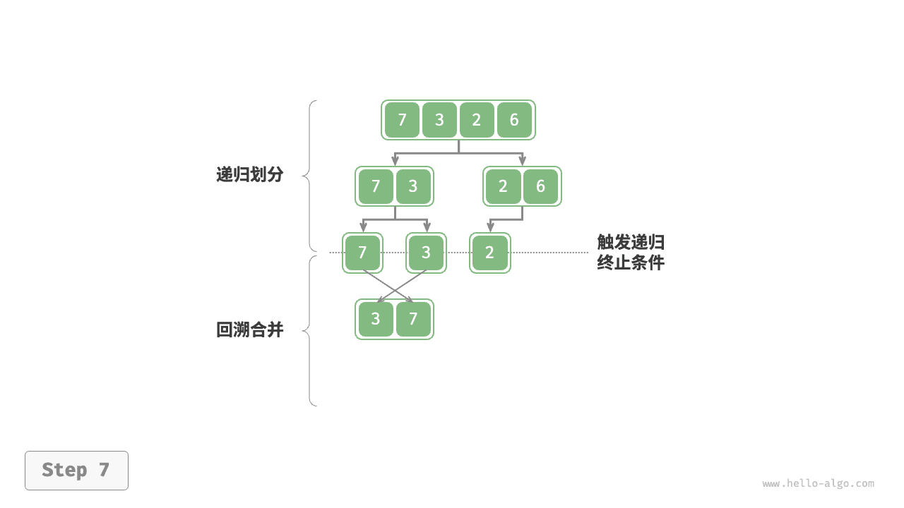

=== "<8>"
    

=== "<9>"
    

=== "<10>"
    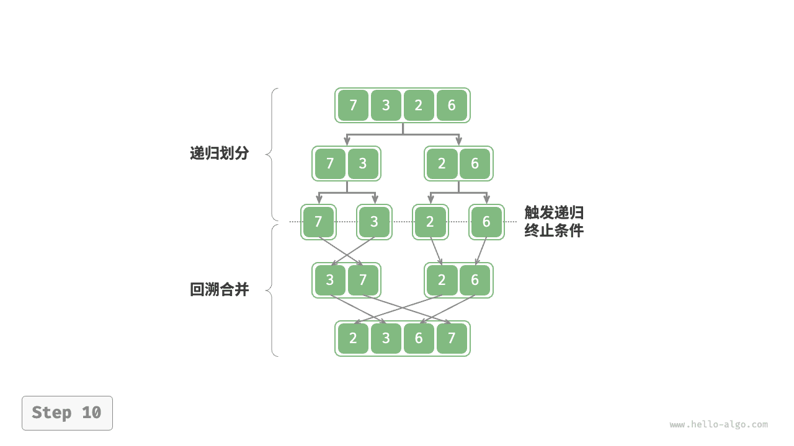

观察发现，归并排序与二叉树后序遍历的递归顺序是一致的。

- **后序遍历**：先递归左子树，再递归右子树，最后处理根节点。
- **归并排序**：先递归左子数组，再递归右子数组，最后处理合并。

归并排序的实现如以下代码所示。请注意，`nums` 的待合并区间为 `[left, right]` ，而 `tmp` 的对应区间为 `[0, right - left]` 。

### 代码

[MergeSort.java](../../../code/algo/sort/MergeSort.java)

### 算法特性

- **时间复杂度为 O(nlog⁡n)、非自适应排序**：划分产生高度为 log⁡n 的递归树，每层合并的总操作数量为 n ，因此总体时间复杂度为 O(nlog⁡n) 。
- **空间复杂度为 O(n)、非原地排序**：递归深度为 log⁡n ，使用 O(log⁡n) 大小的栈帧空间。合并操作需要借助辅助数组实现，使用 O(n) 大小的额外空间。
- **稳定排序**：在合并过程中，相等元素的次序保持不变。

### 链表排序

对于链表，归并排序相较于其他排序算法具有显著优势，**可以将链表排序任务的空间复杂度优化至 O(1)** 。

- **划分阶段**：可以使用“迭代”替代“递归”来实现链表划分工作，从而省去递归使用的栈帧空间。
- **合并阶段**：在链表中，节点增删操作仅需改变引用（指针）即可实现，因此合并阶段（将两个短有序链表合并为一个长有序链表）无须创建额外链表。

## 堆排序

### 算法流程

设数组的长度为 $n$ ，堆排序的流程如下图所示。

1. 输入数组并建立大顶堆。完成后，最大元素位于堆顶。
2. 将堆顶元素（第一个元素）与堆底元素（最后一个元素）交换。完成交换后，堆的长度减 $1$ ，已排序元素数量加 $1$ 。
3. 从堆顶元素开始，从顶到底执行堆化操作（sift down）。完成堆化后，堆的性质得到修复。
4. 循环执行第 `2.` 步和第 `3.` 步。循环 $n - 1$ 轮后，即可完成数组排序。

> [!TIP]
>
> 实际上，元素出堆操作中也包含第 `2.` 步和第 `3.` 步，只是多了一个弹出元素的步骤。

=== "<1>"
    

=== "<2>"
    

=== "<3>"
    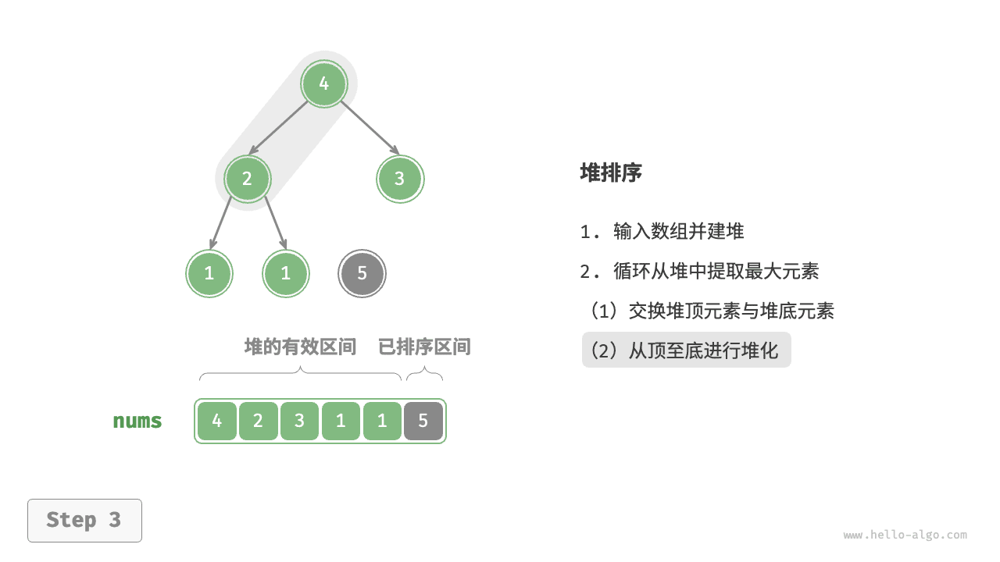

=== "<4>"
    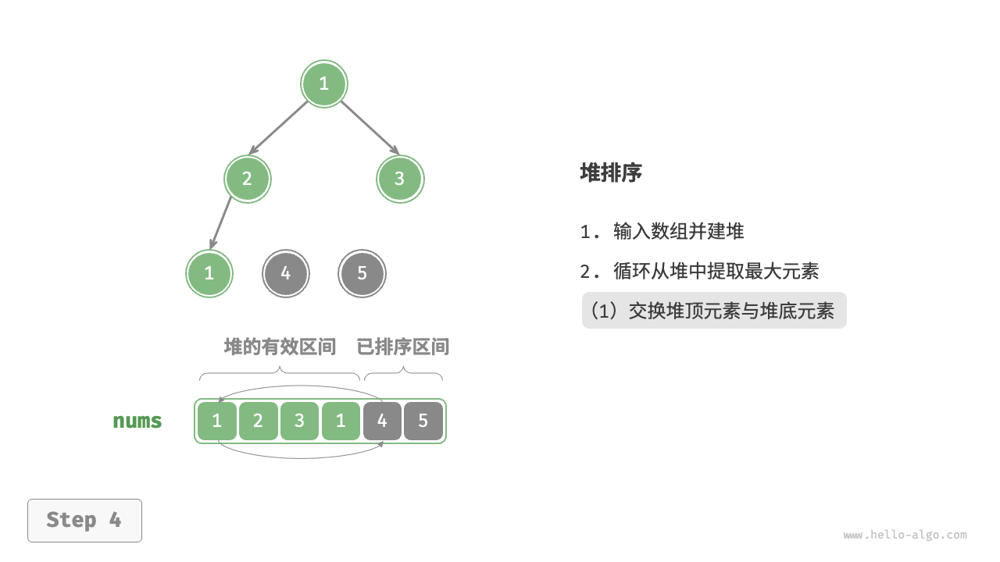

=== "<5>"
    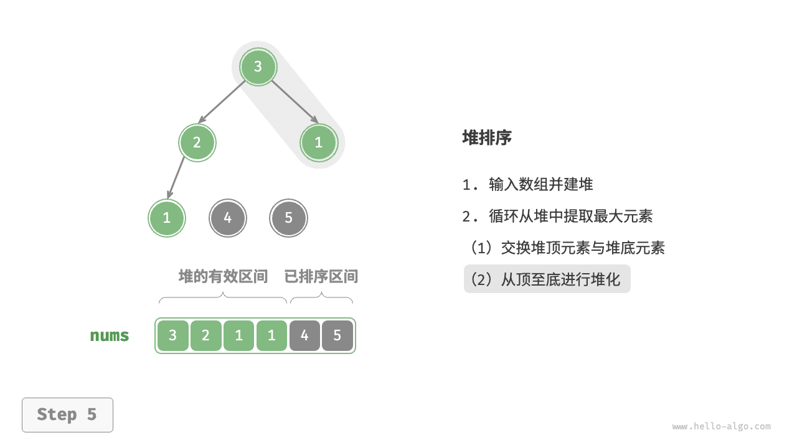

=== "<6>"
    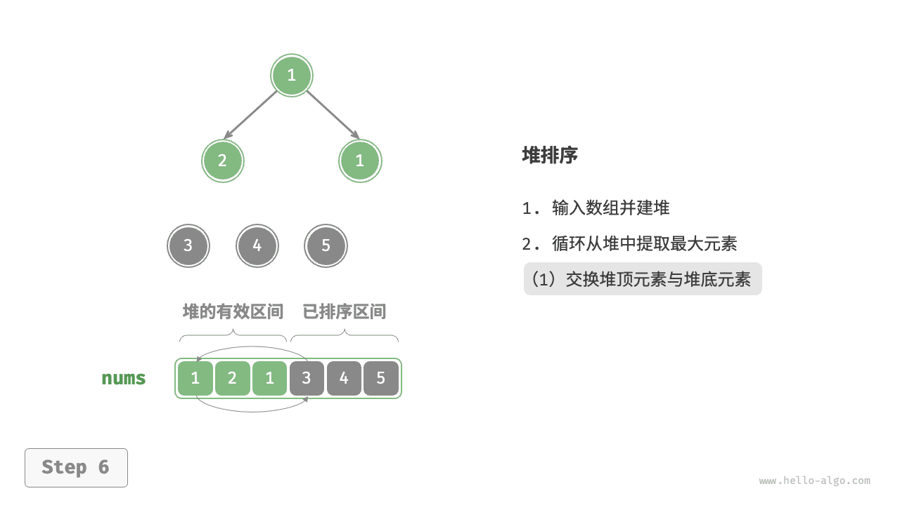

=== "<7>"
    

=== "<8>"
    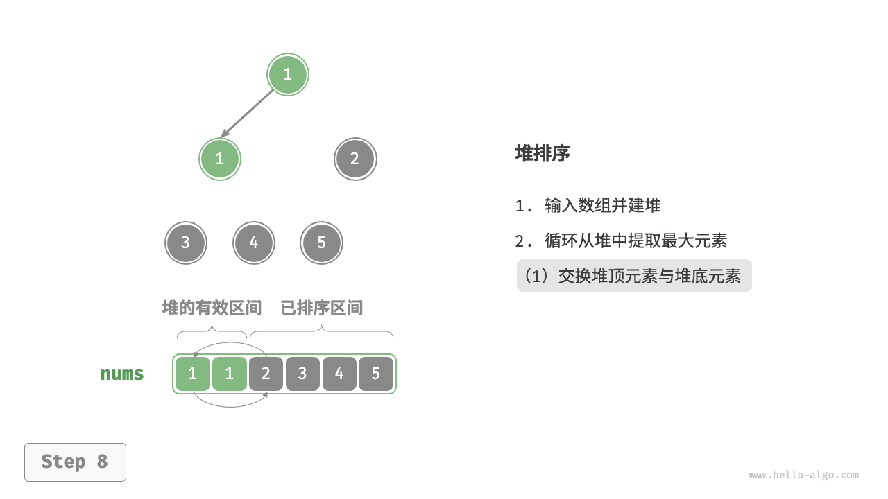

=== "<9>"
    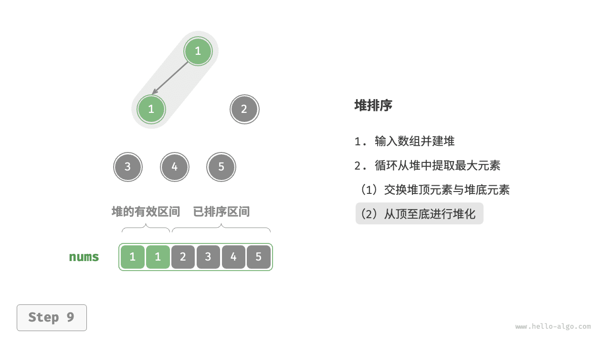

=== "<10>"
    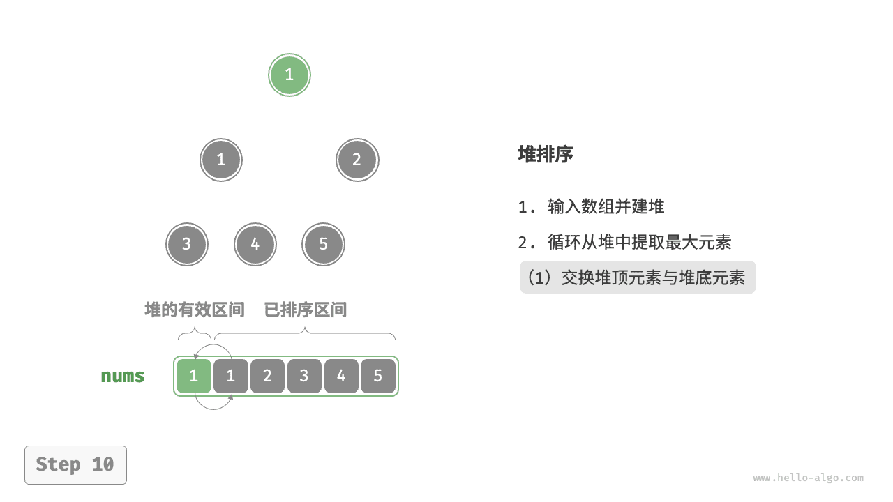

=== "<11>"
    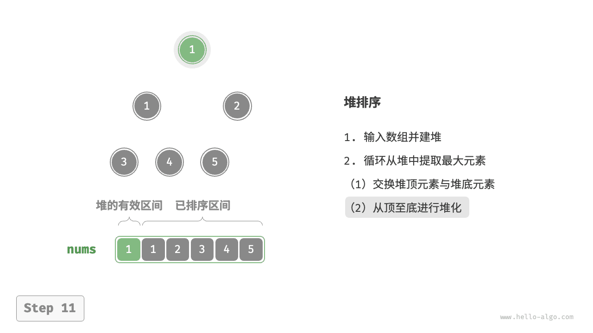

=== "<12>"
    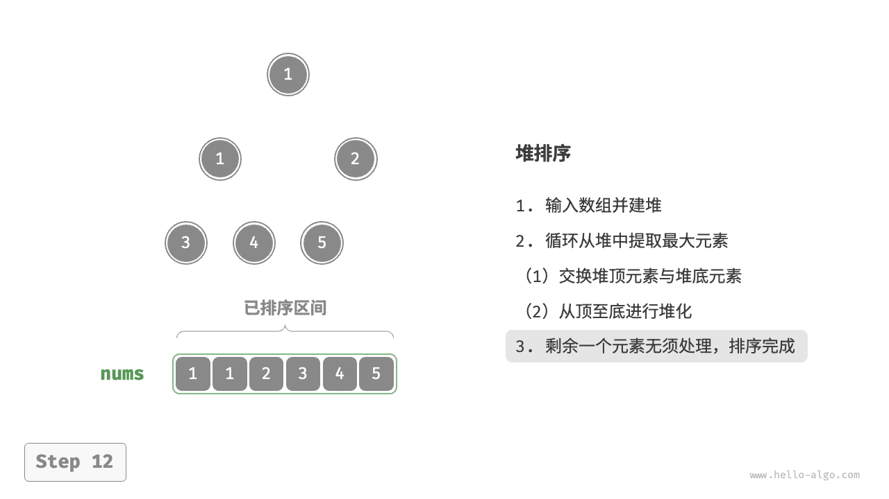

在代码实现中，我们使用了与“堆”章节相同的从顶至底堆化 `sift_down()` 函数。值得注意的是，由于堆的长度会随着提取最大元素而减小，因此我们需要给 `sift_down()` 函数添加一个长度参数 $n$ ，用于指定堆的当前有效长度。代码如下所示：

### 代码

[HeapSort.java](../../../code/algo/sort/HeapSort.java)

### 算法特性

- **时间复杂度为 $O(n \log n)$、非自适应排序**：建堆操作使用 $O(n)$ 时间。从堆中提取最大元素的时间复杂度为 $O(\log n)$ ，共循环 $n - 1$ 轮。
- **空间复杂度为 $O(1)$、原地排序**：几个指针变量使用 $O(1)$ 空间。元素交换和堆化操作都是在原数组上进行的。
- **非稳定排序**：在交换堆顶元素和堆底元素时，相等元素的相对位置可能发生变化。

## 桶排序

## 计数排序

## 基数排序

## 小结

### 重点回顾

- 冒泡排序通过交换相邻元素来实现排序。通过添加一个标志位来实现提前返回，我们可以将冒泡排序的最佳时间复杂度优化到 $O(n)$ 。
- 插入排序每轮将未排序区间内的元素插入到已排序区间的正确位置，从而完成排序。虽然插入排序的时间复杂度为 $O(n^2)$ ，但由于单元操作相对较少，因此在小数据量的排序任务中非常受欢迎。
- 快速排序基于哨兵划分操作实现排序。在哨兵划分中，有可能每次都选取到最差的基准数，导致时间复杂度劣化至 $O(n^2)$ 。引入中位数基准数或随机基准数可以降低这种劣化的概率。通过优先递归较短子区间，可有效减小递归深度，将空间复杂度优化到 $O(\log n)$ 。
- 归并排序包括划分和合并两个阶段，典型地体现了分治策略。在归并排序中，排序数组需要创建辅助数组，空间复杂度为 $O(n)$ ；然而排序链表的空间复杂度可以优化至 $O(1)$ 。
- 桶排序包含三个步骤：数据分桶、桶内排序和合并结果。它同样体现了分治策略，适用于数据体量很大的情况。桶排序的关键在于对数据进行平均分配。
- 计数排序是桶排序的一个特例，它通过统计数据出现的次数来实现排序。计数排序适用于数据量大但数据范围有限的情况，并且要求数据能够转换为正整数。
- 基数排序通过逐位排序来实现数据排序，要求数据能够表示为固定位数的数字。
- 总的来说，我们希望找到一种排序算法，具有高效率、稳定、原地以及自适应性等优点。然而，正如其他数据结构和算法一样，没有一种排序算法能够同时满足所有这些条件。在实际应用中，我们需要根据数据的特性来选择合适的排序算法。
- 下图对比了主流排序算法的效率、稳定性、就地性和自适应性等。

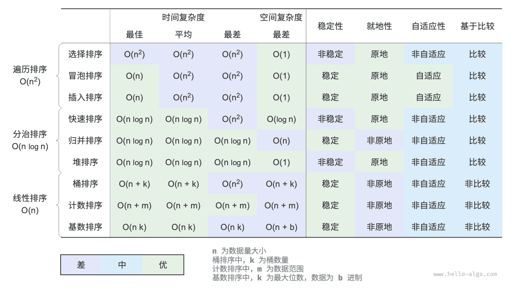

### Q & A

**Q**：排序算法稳定性在什么情况下是必需的？

在现实中，我们有可能基于对象的某个属性进行排序。例如，学生有姓名和身高两个属性，我们希望实现一个多级排序：先按照姓名进行排序，得到 `(A, 180) (B, 185) (C, 170) (D, 170)` ；再对身高进行排序。由于排序算法不稳定，因此可能得到 `(D, 170) (C, 170) (A, 180) (B, 185)` 。

可以发现，学生 D 和 C 的位置发生了交换，姓名的有序性被破坏了，而这是我们不希望看到的。

**Q**：哨兵划分中“从右往左查找”与“从左往右查找”的顺序可以交换吗？

不行，当我们以最左端元素为基准数时，必须先“从右往左查找”再“从左往右查找”。这个结论有些反直觉，我们来剖析一下原因。

哨兵划分 `partition()` 的最后一步是交换 `nums[left]` 和 `nums[i]` 。完成交换后，基准数左边的元素都 `<=` 基准数，**这就要求最后一步交换前 `nums[left] >= nums[i]` 必须成立**。假设我们先“从左往右查找”，那么如果找不到比基准数更大的元素，**则会在 `i == j` 时跳出循环，此时可能 `nums[j] == nums[i] > nums[left]`**。也就是说，此时最后一步交换操作会把一个比基准数更大的元素交换至数组最左端，导致哨兵划分失败。

举个例子，给定数组 `[0, 0, 0, 0, 1]` ，如果先“从左向右查找”，哨兵划分后数组为 `[1, 0, 0, 0, 0]` ，这个结果是不正确的。

再深入思考一下，如果我们选择 `nums[right]` 为基准数，那么正好反过来，必须先“从左往右查找”。

**Q**：关于快速排序的递归深度优化，为什么选短的数组能保证递归深度不超过 $\log n$ ？

递归深度就是当前未返回的递归方法的数量。每轮哨兵划分我们将原数组划分为两个子数组。在递归深度优化后，向下递归的子数组长度最大为原数组长度的一半。假设最差情况，一直为一半长度，那么最终的递归深度就是 $\log n$ 。

回顾原始的快速排序，我们有可能会连续地递归长度较大的数组，最差情况下为 $n$、$n - 1$、$\dots$、$2$、$1$ ，递归深度为 $n$ 。递归深度优化可以避免这种情况出现。

**Q**：当数组中所有元素都相等时，快速排序的时间复杂度是 $O(n^2)$ 吗？该如何处理这种退化情况？

是的。对于这种情况，可以考虑通过哨兵划分将数组划分为三个部分：小于、等于、大于基准数。仅向下递归小于和大于的两部分。在该方法下，输入元素全部相等的数组，仅一轮哨兵划分即可完成排序。

**Q**：桶排序的最差时间复杂度为什么是 $O(n^2)$ ？

最差情况下，所有元素被分至同一个桶中。如果我们采用一个 $O(n^2)$ 算法来排序这些元素，则时间复杂度为 $O(n^2)$ 。