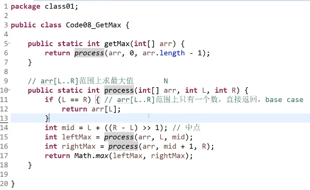

# 左神算法02——认识O(NlogN)的排序

1. 求两个索引的中点位置：int mid = L + ((R-L) >> 1);//右移一位比除2要快

   1. 常规写法int mid = (L+R)/2; 当数组长度很大的时候可能溢出算出来是个负数

2. arr[L...R]范围上求最大值

   1. 

3. Master公式：T(N)=a*T(N/b) + O(N^d)

   1. 满足子问题等规模的递归行为，求时间复杂度可用公式
   2. a是子问题执行次数，b是母问题数据等分成几份，O(N^d)是除了子问题调用之外剩下的时间复杂度
   3. 结果是
      1. log(b, a)<d =>O(N^d)
      2. log(b, a)>d =>O(N^log(b, a) )
      3. log(b, a)=d =>O(N^d * logN)

4. 归并排序——O(NlogN)，额外空间复杂度O(N)

   1. ```java
      import java.util.Arrays;
      import java.util.Scanner;
      
      
      // 注意类名必须为 Main, 不要有任何 package xxx 信息
      public class Main {
          public static void main(String[] args) {
              Scanner in = new Scanner(System.in);
              // 注意 hasNext 和 hasNextLine 的区别
              while (in.hasNextInt()) { // 注意 while 处理多个 case
                  int n = in.nextInt();
                  int[] arr = new int[n];
                  for (int i = 0; i < n; i++) {
                      int a = in.nextInt();
                      arr[i] = a;
                  }
                  mergeSort(arr);
                  System.out.println(Arrays.toString(arr));
              }
          }
      
      
          private static void mergeSort(int[] arr) {
              if (arr == null || arr.length < 2) {
                  return;
              }
              process(arr, 0, arr.length - 1);
          }
      
      
          private static void process(int[] arr, int l, int r) {
              if (l == r) {
                  return;
              }
              int mid = l + ((r - l) >> 1);
              process(arr, l, mid);
              process(arr, mid + 1, r);
              merge(arr, l, mid, r);
          }
      
      
          private static void merge(int[] arr, int l, int mid, int r) {
              int[] temp = new int[r - l + 1];
              int i = l, j = mid + 1;
              int k = 0;
              while (i <= mid && j <= r) {
                  if (arr[i] <= arr[j]) {
                      temp[k++] = arr[i++];
                  } else {
                      temp[k++] = arr[j++];
                  }
              }
              while (i <= mid) {
                  temp[k++] = arr[i++];
              }
              while (j <= r) {
                  temp[k++] = arr[j++];
              }
              System.arraycopy(temp, 0, arr, l, temp.length);
          }
      }
      ```

5. 求小和问题

6. 逆序对